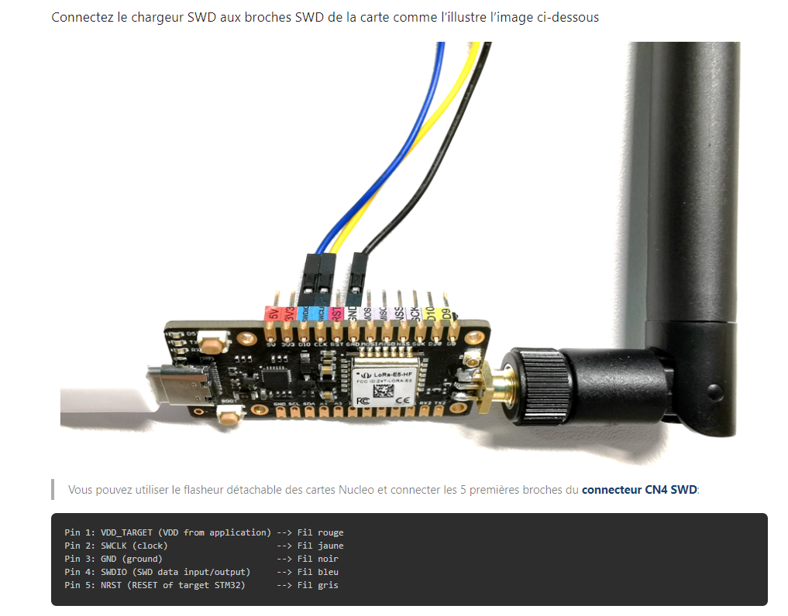

Synthesis for flashing the card inspired by : https://wiki.seeedstudio.com/LoRa_E5_Dev_Board/#23-build-the-lorawan-end-node-example

# Connecting the card 
- Make the following connection and then connect the two cards to the PC:



- Open STM32CubeProgrammer, connect **ST-LINK** (not UART) to your PC
- hold RESET on the LORA card
- click on Connect while holding RESET then release 

- In READOUT PROTECTION: Make sure the read protection is AA, if it shows as BB, select AA and click Apply.

- Now go to the Erasing & Programming page, and select your file path.
- Check verify programming and Run after programming.

# Tutorials and sensor information

Sample code for the use of the turbidity sensor : https://wiki.dfrobot.com/Turbidity_sensor_SKU__SEN0189

Help and documentation for water quality measurement : https://gitlab.com/stm32python/fr-version-lora/-/blob/master/site/_riot_tuto/sensors.md#mesure-de-la-qualit%C3%A9-de-leau

## Grove I2C Module
Documentation using the Grove I2C module to connect the sensors: https://wiki.seeedstudio.com/Grove-I2C_Hub/

# Tutorials for RIOT programming

Command to compile under RIOT for the Lora-E5-mini board: `make BOARD=lora-e5-dev LORA_DRIVER=sx126x_stm32wl REGION=EU433`

Complete course on the use of RIOT : https://github.com/riot-os/riot-course

RIOT code base for tutorials : https://github.com/iot-lab/iot-lab-training


# Tutorials for the use of the LoRaWan protocol and LoRa
Basic Lora tutorial : https://stm32python.gitlab.io/fr-version-lora/lora.html

**Summary of the tutorial to obtain the basic program :**

```
    cd RIOT/tests/pkg_semtech-loramac/
    make BOARD=lora-e5-dev LORA_DRIVER=sx126x_stm32wl REGION=EU433
```
> Then flash the card
```
loramac set deveui AAAAAAAAAAAAAAAA
loramac set appeui BBBBBBBBBBBBBBBB
loramac set appkey CCCCCCCCCCCCCCCCCCCCCCCCCCCCCCCC

loramac set rx2_dr 3

loramac join otaa

loramac set dr 5

loramac tx This\ is\ RIOT!
```
> In TTN to view the messages, in `Payload formatters>Uplink` put :

```js
function decodeUplink(input) {
var message = "";

for  (var i=0; i < input.bytes.length; i++) {
    message += String.fromCharCode(input.bytes[i]);
}

return {
    data: {
      message: message,
    },
    warnings: [],
    errors: []
  };
}
```
> Then click on save changes

Code base, existing project of altitude probe : https://github.com/CampusIoT/orbimote/tree/dbcfcf61f52d5c4bf31ca670513c49a51c236ad5

## Tutorials for the use of ThingsBoard/Cayenne

Cayenne : https://github.com/RIOT-OS/RIOT/tree/master/pkg/cayenne-lpp

# Help with building the raft

Example of a raft similar to the one to be built: https://nevonprojects.com/iot-water-pollution-monitor-rc-boat/
