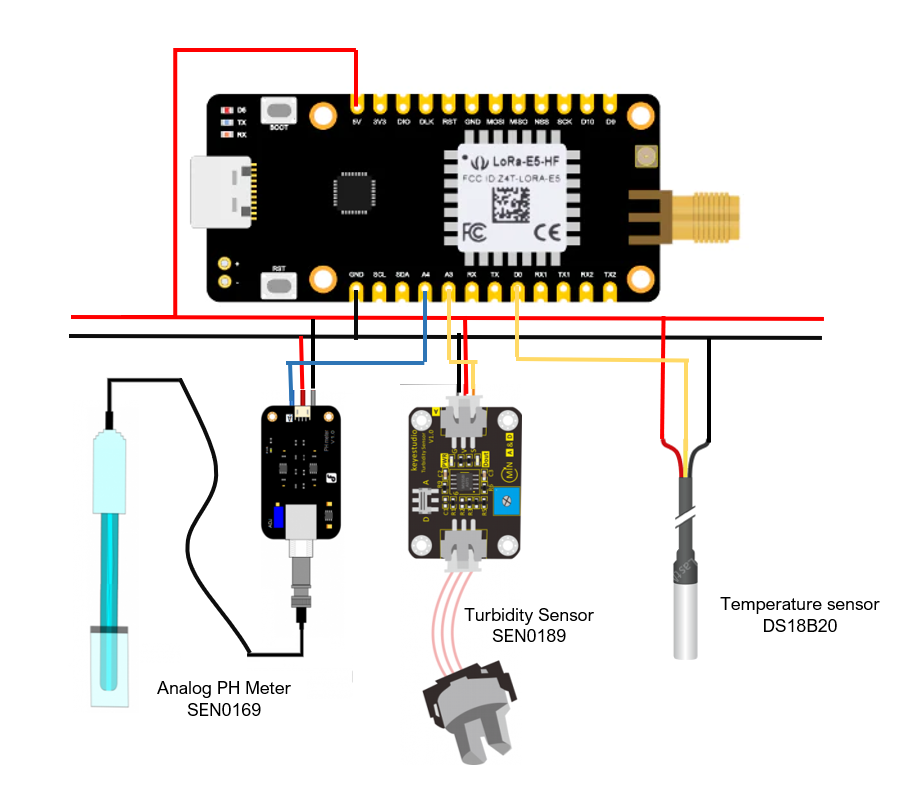

## Floating Water Project
Overview of data obtain by the sensors : https://cayenne.mydevices.com/shared/622617163916a44bc3006fba/project/6c969f19-84d3-4e0c-a026-6479296ef3f5

### Temperature sensor connection
Connection of the DS18 temperature sensor to the LoraE5 board:
- Red wire: 5V
- Black wire: GND
- Yellow wire: D0
- White wire: not used

### Turbidity sensor connection
Connection of the turbidity sensor to the LoraE5 board:
- Red wire: 5V
- Black wire: GND
- Blue : A3

### Temperature sensor connection
Connection of the DS18 temperature sensor to the LoraE5 board:
- Red wire: 5V
- Black wire: GND
- Yellow wire: D0
- White wire: not used

### pH sensor connection
Connection of the turbidity sensor to the LoraE5 board:
- **Red wire: GND**
- **Black wire: 5V**
- Blue : A4

